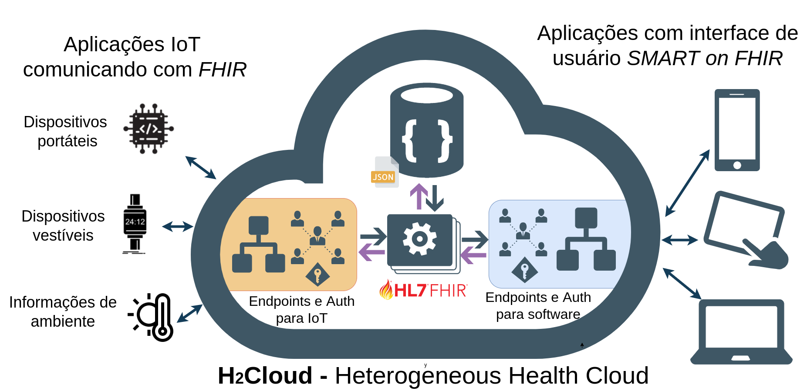

# Projeto H2Cloud
  


A Figura ilustra a visão geral de **H2Cloud**  – *Heterogeneous Health Cloud* (Nuvem de Saúde Heterogênea) e os variados tipos de aplicações web de saúde previstas na comunicação do ecossistema  de saúde digital. 
A autenticação com [*SMART on FHIR*](https://hl7.org/fhir/smart-app-launch/) eh aplicada de diferentes formas dependendo da natureza da aplicação. Uma vez autenticadas, as aplicações *SMART on FHIR* trocam dados com H2Cloud usando recursos [*FHIR*](https://hl7.org/fhir/). O processamento e o armazenamento dos recursos FHIR habilitam a troca de dados entre as diferentes aplicações.


## Requisitos
- NodeJS [https://nodejs.org/en/](https://nodejs.org/en/)
- MongoDB [https://www.mongodb.com/](https://www.mongodb.com/)
- Docker e Docker Compose [https://docs.docker.com/](https://docs.docker.com/)
- Aplicação H2Cloud (este repositório)


## Instalação
1. Faca download deste repositorio
```sh
git clone https://github.com/if4health/h2cloud .
```
2. Configure variaveis de ambiente, alem de `SERVER_PORT` e `DB_*`, eh importante notar:

- `OAUTH_SECRET` - Chave simétrica usada com os dispositivos IoT
- `OAUTH_PUB` - Chave pública para token de usuários
- `OAUTH_PRIVATE` - Chave privada para assinar tokens de usuários
- `DEFAULT_URL` - ???

Configure apenas se utilizar AWS Version
- `AWS_BUCKET_NAME` - Variável do ambiente S3
- `AWS_BUCKET_REGION` - Variável do ambiente S3
- `AWS_ACCESS_KEY` - Variável do ambiente S3
- `AWS_SECRET_KEY` - Variável do ambiente S3


3. Instale as dependencias de NodeJS para este projeto 
```sh
npm install
cd h2cloud/
```


## Utilização
Apos o set-up do ambiente escolhido, voce precisa destes comandos para executar
No diretorio `h2cloud` execute:
```sh
npm dev
```
Visualize o servidor rodando no navegador:
```sh
http://localhost:${SERVER_PORT}/
```


## Rotas
| Rota               | Metodo | Descricao                                                                                                  |
|--------------------|--------|------------------------------------------------------------------------------------------------------------|
| `/well-known/smart-configuration` | GET | Mostra as configurações para autenticação |
| `/auth/register` | GET | Inicia o processo de autenticação |
| `/auth/login` | GET | Exibe a tela de login |
| `/auth/login` | POST | Efetua o login do usuário, sendo paciente ou médico |
| `/auth/authorize` | GET | Exibe a tela das permissões solicitadas pela aplicação |
| `/auth/authorize` | POST | Confirma a autorização da aplicação pelo usuário |
| `/auth/list` | GET | Exibe lista de pacientes do login do médico |
| `/auth/select` | POST | Seleciona o paciente para exibir os dados |
| `/auth/token` | POST | Gera um token com os grant_types: 'authorization_code' e 'client_credentials' |


## Deploy na AWS
Para fazer Deploy do seu container na AWS.

```sh
Em construcao...
```